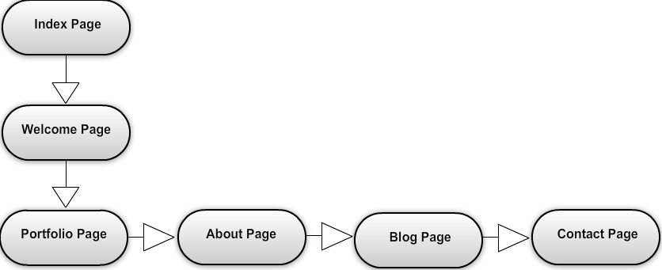

#My Site Map

##1. What are the 6 Phases of Web Design?

###Phase 1 The information Gathering face:
At this stage a designer will gather all the important information needed from the client to find out what they are looking for and who they are targeting. Gathering information is essential for the designer because they can ask all the questions in order for the other steps to go smoothly. Having this step is great because clients usually expect the designer to come up with the plan and strategy, which is the wrong way to do business. Without gathering enough details from the clients the other section will operate with flaws and errors, which cost money and time. 

###Phase 2 Planning:
Here you begin to make a site map to get a better idea of the overall land of the website. Basically understanding how many pages you will need and what you want the flow to be when a user begins to use the website. You also begin to figure out what languages you will use to make the site as efficient at possible.

###Phase 3 Design:
At this stage the design team will begin working on the wireframes for each page you created on the site map. Creating the layout of each of the pages helps the client see what the site will look like before it is deployed. This is step is important and keeping good communication with the client and the team will save you plenty of time. It is much easier to fix a wireframe than to fix the look using code. Like I said before if you gather enough information during step 1 you will move on right away to development without making many changes. However, if you did not gather enough information you will drive your team and your client insane. 

###Phase 4 Development:
This is the stage where the developers begin to make the website real by using the languages they agreed on. The designers will help in this stage with their visual experience and making sure everything is coming along as agreed on in the planning stage. My advice is that this stage only begins when the client is 100% happy with the overall design and layout of the website. Developers are expensive.

 
###Phase 5 Testing and Delivery:
At this point you testing is being done to the website to make sure that is compatible with every web browser. To make sure the scripts are running smooth and correct. After everything is working correctly the website will be available to the public. At this point the design team and development team will work on Search engine optimization to make sure the site at least comes up on the first page of all search engines. It will help your clients business. 

### Phase 6 Maintenance:
After you are complete with the website and its up and running you will determine how much time you will have to give your client for future maintenance. Then you should have a separate cost for the client so that they see the benefits of updating the website constantly and Improving the code and making touch ups. If your website was design perfectly, this is the area where you make an extra dollar. This is the part where you offer them insurance for 1 year and you know the site wont needed until 2 years. 

##2. What is your site's primary goal or purpose? What kind of content will your site feature?

The primary goal to my site is to promote my services as a full stack web developer **(when I get there)**. I will feature the most beautiful work and most complicated work so that they can get a sense of my technical ability and creative ability. I will provide a blog that will keep them aware of what I am currently working on. 

##3. What is your target audience's interests and how do you see your site addressing them?

My target audience are those who are in the market for creating a website or are looking for a web developer who can contribute to their development team. I believe my site will address their needs because they can read about me and see the type of work I do. They will notice how much attention to detail I put on my work. For the audience who are not computer savvy they will focus mainly on my creativity and look of the website. For the computer geeks it will be base on the code of my projects and see if I follow common conventions and if they see themselves working with me.

##4. What is the primary "action" the user should take when coming to your site? Do you want them to search for information, contact you, or see your portfolio? It's ok to have several actions at once, or different actions for different kinds of visitors.

The primary action that I want my visitors to do is to see my portfolio. Any audience will focus on this area first. If they are developers looking to hire me they will go see the code of every project. If they are regular consumers they will see the look of my portfolio sites. After they will want to learn more about me and check my blog to see what I’ve been doing or even find reviews of other people who I have helped. This will make them either want to continue learning about me or just move on to the next developer. 

##5. What are the main things someone should know about design and user experience?

User experience and design play an important role together. Design is when you determine the look of the website by choosing the colors, creating wireframes and overall feel of the site to address the main goal? UX (user experience) will focus mainly on the navigation of the website and how easy the flow is for the target consumer. Understanding the user experience is important because you want your user to get from point A – Z directly and skipping everything in-between. Users like simple, beautiful designed websites and with a great UX it makes everyone’s lives easier. 

##6. What is user experience design and why is it valuable? 

User experience design is simply designing a website that is beautiful but with their main focus on making it easier for the target user. UX design will study and evaluate how users feel about a system, looking at such things as ease of use, perception of the value of the system, and efficiency in performing tasks and so forth. It makes it valuable because your end user will continue coming back to your site and recommending it to others. Without UX design you have a higher change that your users wont return because of the difficulty of simple tasks. 

##7. Which parts of the challenge did you find tedious?

I think trying to find a service that was good and free in order to create a site map or a wireframe was difficult to find. Every service out there is charging a monthly subscription. 

I found one that is pretty good and its completely free check it out: [Mockflow Site](https://app.mockflow.com/index.jsp?logout=yes)

